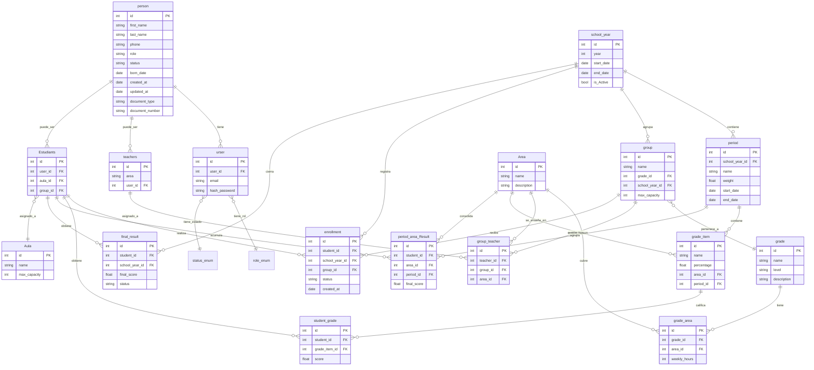
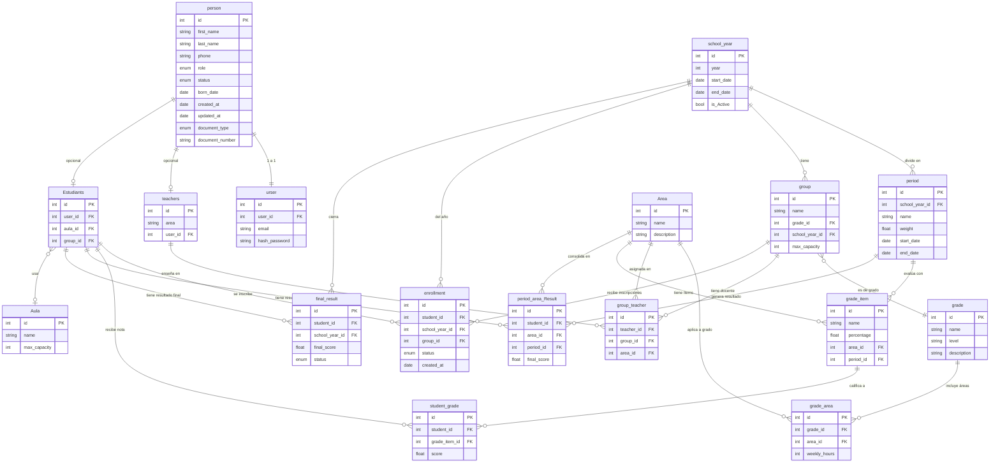

<div align="center">

# EduConnect - Sistema de Gestión Educativa

**Base de Datos para el Proyecto EduConnect en MongoDB**

---

**Autores:** Alexi Durán Gómez


**Ruta:** NODE - MONGODB

**Ubicación:** Bucaramanga, Santander

**Año:** 2026 - FEB - 26

---

</div>

## 📑 Índice

1. [Introducción](#introducción)
   - [Objetivo del Sistema](#objetivo-del-sistema)
   - [Tecnología Utilizada](#tecnología-utilizada)
2. [Caso de Estudio](#caso-de-estudio)
   - [Problemática Actual](#problemática-actual)
   - [Solución Propuesta](#solución-propuesta)
3. [Justificación del Uso de MongoDB](#justificación-del-uso-de-mongodb)
4. [Planificación](#planificación)
   - [Modelo Conceptual](#modelo-conceptual)
   - [Descripción de Entidades](#descripción-de-entidades)
5. [Construcción del Modelo Lógico](#construcción-del-modelo-lógico)
   - [Modelo Lógico](#modelo-lógico)
   - [Descripción Técnica del Modelo](#descripción-técnica-del-modelo)
6. [Normalización del Modelo Lógico](#normalización-del-modelo-lógico)
7. [Construcción del Modelo Físico](#construcción-del-modelo-físico)
   - [Colecciones y JSON Schema](#colecciones-y-json-schema)
   - [Índices](#índices)
   - [Decisiones de Diseño: Referencias vs. Embebidos](#decisiones-de-diseño-referencias-vs-embebidos)
8. [Referencias](#referencias)

---

<div align="center">

## Introducción

</div>

Este documento presenta la documentación completa del sistema de información **EduConnect**, una plataforma educativa diseñada para gestionar instituciones escolares con múltiples grados, grupos, áreas, profesores, estudiantes y periodos académicos. El sistema ha sido concebido para resolver los problemas típicos de gestión académica dispersa, centralizando la información en una base de datos NoSQL flexible y escalable.

La implementación sigue las mejores prácticas de desarrollo con MongoDB:

- Validación de esquemas mediante JSON Schema
- Indexación estratégica para optimizar consultas
- Control de acceso mediante roles de usuario
- Modelo de datos híbrido con referencias y estructuras embebidas según el patrón de acceso
- Soporte transaccional para operaciones críticas como inscripciones y registro de calificaciones

### Objetivo del Sistema

Proporcionar una plataforma unificada que permita:

- Gestionar personas (estudiantes, profesores, administradores) con roles diferenciados
- Administrar grupos, grados, áreas y periodos académicos
- Controlar inscripciones de estudiantes en grupos
- Registrar y consultar calificaciones por área, periodo y ítem de evaluación
- Gestionar aulas y asignación de profesores a grupos y áreas
- Generar reportes sobre resultados finales por año escolar

### Tecnología Utilizada

El sistema está desarrollado sobre MongoDB, un sistema de gestión de bases de datos NoSQL orientado a documentos. Se ha seleccionado por su flexibilidad de esquema, capacidades avanzadas de agregación y facilidad de modelado para entidades con atributos heterogéneos como personas con distintos roles.

---

<div align="center">

## Caso de Estudio

</div>

**EduConnect** es una plataforma para instituciones educativas que operan con múltiples grados, grupos de estudiantes, áreas de conocimiento y docentes asignados a cada área y grupo. La institución maneja ciclos académicos anuales (school_year) divididos en periodos, con registro de calificaciones por ítem de evaluación y resultado final por periodo y área.

### Problemática Actual

1. **Dispersión de Información:** Los datos de estudiantes, profesores, grupos y calificaciones se encuentran en sistemas o hojas de cálculo independientes, lo que dificulta la trazabilidad académica.

2. **Gestión de Roles Compleja:** Un mismo usuario puede ser administrador, profesor o estudiante, y los sistemas tradicionales no manejan bien esta jerarquía.

3. **Inscripciones sin Validación:** No existe mecanismo automático para validar cupos por grupo ni para verificar si un estudiante ya está inscrito activamente.

4. **Calificaciones Fragmentadas:** Los resultados por área y periodo (period_area_Result) y las calificaciones por ítem (student_grade) están desvinculados, dificultando el análisis del desempeño estudiantil.

5. **Falta de Trazabilidad del Año Escolar:** El resultado final por año (final_result) no siempre está vinculado coherentemente con los periodos y áreas evaluadas.

### Solución Propuesta

Migrar a un sistema centralizado basado en MongoDB que:

- Unifique la información de personas, roles y perfiles en colecciones estructuradas
- Implemente validaciones automáticas de integridad y reglas de negocio mediante JSON Schema
- Permita transacciones para operaciones críticas como inscripciones y registro de notas
- Ofrezca capacidades avanzadas de agregación para reportes de rendimiento académico
- Implemente un sistema de roles y permisos granular

---

<div align="center">

## Justificación del Uso de MongoDB

</div>

### 1. Flexibilidad del Esquema

El modelo de datos educativo es naturalmente heterogéneo. Una persona puede ser estudiante, profesor o administrador con atributos distintos en cada caso. MongoDB permite extender el modelo sin migraciones costosas.

### 2. Modelo de Documentos Orientado a Objetos

Las entidades del sistema —como una inscripción con su estado, o un ítem de calificación con su porcentaje— se mapean directamente a documentos JSON, facilitando la integración con aplicaciones Node.js.

### 3. Capacidades de Agregación Avanzadas

El framework de agregación de MongoDB permite calcular promedios de calificaciones, detectar estudiantes en riesgo, listar grupos por área, y consolidar resultados por periodo y año sin necesidad de múltiples queries relacionales.

### 4. Transacciones ACID Multi-Documento

Las inscripciones de estudiantes y el registro de calificaciones requieren atomicidad. MongoDB garantiza que la inserción en `enrollment` y la actualización de cupos en `group` ocurran como una operación atómica o se reviertan completamente.

### 5. Sistema de Roles y Autenticación Integrado

MongoDB ofrece control de acceso basado en roles (RBAC) con permisos a nivel de colección, ideal para separar las capacidades de administradores, profesores y estudiantes.

### 6. Escalabilidad Horizontal

El sistema puede crecer con la institución educativa: nuevas sedes, más estudiantes, más periodos, sin necesidad de cambiar la arquitectura fundamental.

### 7. Validación de Esquemas JSON Schema

Cada colección define reglas de validación declarativas que garantizan tipos de datos correctos, campos obligatorios y valores permitidos en cada operación de escritura.

---

<div align="center">

## Planificación

</div>

### Modelo Conceptual

El sistema EduConnect se articula alrededor de la entidad **person**, que centraliza la información personal de todos los actores del sistema. A partir de esta entidad se extienden perfiles especializados como **teachers** (profesores) y **Estudiants** (estudiantes). El ciclo académico está representado por **school_year**, que contiene múltiples **period** (periodos evaluativos) y agrupa a los estudiantes en **group** (grupos), los cuales pertenecen a un **grade** (grado). Las calificaciones se registran a nivel de ítem (**grade_item**) y se consolidan por área y periodo en **period_area_Result**. El resultado final del año escolar se almacena en **final_result**.

### Descripción de Entidades

---

**1. person**

Entidad central del sistema que almacena la información personal y de contacto de todos los usuarios.

**Atributos:**

- **id (PK):** Identificador único de la persona.
- **first_name:** Nombre de la persona.
- **last_name:** Apellido de la persona.
- **phone:** Teléfono de contacto.
- **role | ENUM:** Rol asignado (Student, Teacher, Admin).
- **status | ENUM:** Estado de la persona (active, inactive, pending).
- **born_date:** Fecha de nacimiento.
- **created_at:** Fecha de creación del registro.
- **updated_at:** Fecha de última actualización.
- **document_type:** Tipo de documento de identidad (CC, RC, CE).
- **document_number:** Número del documento de identidad.

---

**2. urser (User)**

Entidad de autenticación que vincula una persona con sus credenciales de acceso al sistema.

**Atributos:**

- **id (PK):** Identificador único del usuario.
- **user_id (FK):** Referencia a la persona asociada.
- **email:** Correo electrónico de acceso.
- **hash_password:** Contraseña cifrada.

---

**3. teachers**

Perfil especializado para los docentes del sistema.

**Atributos:**

- **id (PK):** Identificador único del profesor.
- **area:** Área de especialización del docente.
- **user_id (FK):** Referencia al usuario asociado.

---

**4. Estudiants (Estudiantes)**

Perfil especializado para los estudiantes de la institución.

**Atributos:**

- **id (PK):** Identificador único del estudiante.
- **user_id (FK):** Referencia al usuario asociado.
- **aula_id (FK):** Aula asignada al estudiante.
- **group_id (FK):** Grupo al que pertenece el estudiante.

---

**5. school_year**

Representa el año o ciclo académico de la institución.

**Atributos:**

- **id (PK):** Identificador único del año escolar.
- **year:** Año calendario (ej: 2025).
- **start_date:** Fecha de inicio del ciclo.
- **end_date:** Fecha de finalización del ciclo.
- **is_Active:** Indica si el año escolar está activo.

---

**6. period**

Representa los periodos evaluativos dentro de un año escolar.

**Atributos:**

- **id (PK):** Identificador único del periodo.
- **school_year_id (FK):** Año escolar al que pertenece.
- **name:** Nombre del periodo (ej: Primer Periodo).
- **weight:** Peso porcentual del periodo en la nota final.
- **start_date:** Fecha de inicio.
- **end_date:** Fecha de finalización.

---

**7. group**

Representa un grupo de estudiantes de un grado en un año escolar específico.

**Atributos:**

- **id (PK):** Identificador único del grupo.
- **name:** Nombre del grupo (ej: 10A, 11B).
- **grade_id (FK):** Grado al que pertenece el grupo.
- **school_year_id (FK):** Año escolar asociado.
- **max_capacity:** Capacidad máxima de estudiantes.

---

**8. grade**

Representa los grados académicos de la institución.

**Atributos:**

- **id (PK):** Identificador único del grado.
- **Row 1, Row 2, Row 3:** Campos descriptivos del grado (nombre, nivel, descripción).

---

**9. Area**

Representa las áreas de conocimiento o asignaturas del currículo.

**Atributos:**

- **id (PK):** Identificador único del área.
- **name:** Nombre del área (ej: Matemáticas, Lenguaje).
- **description:** Descripción del área.
- **Row 3:** Campo adicional descriptivo.

---

**10. grade_area**

Tabla de relación que vincula grados con áreas y define las horas semanales de cada asignatura por grado.

**Atributos:**

- **id (PK):** Identificador único.
- **grade_id (FK):** Grado asociado.
- **area_id (FK):** Área asociada.
- **weekly_hours:** Horas semanales asignadas.

---

**11. group_teacher**

Tabla de relación que asigna profesores a grupos por área.

**Atributos:**

- **id (PK):** Identificador único.
- **teacher_id (FK):** Profesor asignado.
- **group_id (FK):** Grupo al que se asigna.
- **area_id (FK):** Área que enseña el profesor en ese grupo.

---

**12. Aula**

Representa los espacios físicos donde se imparten las clases.

**Atributos:**

- **id (PK):** Identificador único del aula.
- **name:** Nombre o código del aula.
- **max_capacity:** Capacidad máxima de personas.

---

**13. enrollment**

Registra la inscripción de un estudiante en un grupo para un año escolar determinado.

**Atributos:**

- **id (PK):** Identificador único de la inscripción.
- **student_id (FK):** Estudiante inscrito.
- **school_year_id (FK):** Año escolar.
- **group_id (FK):** Grupo en el que se inscribe.
- **status (ENUM):** Estado de la inscripción (active, transferred, retired).
- **created_at:** Fecha de creación de la inscripción.

---

**14. grade_item**

Define los ítems de evaluación dentro de un área y periodo.

**Atributos:**

- **id (PK):** Identificador único del ítem.
- **name:** Nombre del ítem evaluativo (ej: Taller 1, Examen Parcial).
- **percentage:** Porcentaje que representa dentro del periodo.
- **area_id (FK):** Área a la que pertenece.
- **period_id (FK):** Periodo al que pertenece.

---

**15. student_grade**

Registra la calificación de un estudiante en un ítem de evaluación específico.

**Atributos:**

- **id (PK):** Identificador único.
- **student_id (FK):** Estudiante evaluado.
- **grade_item_id (FK):** Ítem de evaluación.
- **score:** Calificación obtenida.

---

**16. period_area_Result**

Consolida el resultado final de un estudiante en un área para un periodo específico.

**Atributos:**

- **id (PK):** Identificador único.
- **student_id (FK):** Estudiante evaluado.
- **area_id (FK):** Área evaluada.
- **period_id (FK):** Periodo evaluado.
- **final_score:** Nota consolidada del periodo en esa área.

---

**17. final_result**

Almacena el resultado final del año escolar de un estudiante.

**Atributos:**

- **id (PK):** Identificador único.
- **student_id (FK):** Estudiante.
- **school_year_id (FK):** Año escolar.
- **final_score:** Promedio o nota final del año.
- **status (ENUM):** Resultado del año (passed, failed, repeating).

---

### Modelo Conceptual



---

<div align="center">

## Construcción del Modelo Lógico

</div>

El modelo lógico de EduConnect refleja la arquitectura completa del sistema educativo con sus relaciones. Se identifican tres subsistemas principales: el subsistema de **identidades** (person, urser, teachers, Estudiants), el subsistema **académico-estructural** (school_year, period, group, grade, Area, grade_area, group_teacher, Aula) y el subsistema de **evaluación** (enrollment, grade_item, student_grade, period_area_Result, final_result).

### Modelo Lógico



### Descripción Técnica del Modelo

El modelo implementa una arquitectura referencial normalizada donde todas las entidades usan claves primarias (`id`) artificiales. Las relaciones se establecen mediante claves foráneas que garantizan integridad referencial, aunque en MongoDB esta integridad se implementa a nivel de aplicación.

**Patrones de acceso identificados:**

- La entidad `person` es el hub central: casi todas las consultas de usuarios implican un join con esta tabla.
- `enrollment` es la entidad transaccional más crítica, con alto volumen de lecturas y escrituras.
- `student_grade` y `period_area_Result` son las entidades con mayor crecimiento de datos conforme avanza el año escolar.
- `group_teacher` resuelve la relación muchos-a-muchos entre profesores, grupos y áreas.

**Decisiones de desnormalización controlada:**

- `Estudiants.group_id` es una desnormalización que permite acceso directo al grupo del estudiante sin pasar por `enrollment`, lo que acelera consultas de perfil estudiantil.
- `teachers.area` almacena la especialidad principal del profesor como texto, aunque existe la entidad `Area`. Esto es una simplificación que evita joins adicionales para consultas de perfil básico.

---

<div align="center">

## Normalización del Modelo Lógico

</div>

### Primera Forma Normal (1FN)

El modelo cumple la 1FN porque todas las entidades presentan atributos atómicos e indivisibles, con identificadores únicos en cada tabla. Por ejemplo, `person` almacena `first_name` y `last_name` como campos separados (no concatenados), y `grade_item` almacena `percentage` como un valor numérico único. Los campos ENUM como `role`, `status` y `document_type` almacenan un único valor por registro. La tabla `period_area_Result` no presenta grupos repetitivos: cada combinación de estudiante, área y periodo ocupa un único documento.

**Punto de análisis:** El campo `area` en `teachers` almacena texto libre que representa la especialidad, cuando podría ser una referencia a la entidad `Area`. Esto es una simplificación intencional para consultas de perfil rápido, documentada como decisión de diseño.

### Segunda Forma Normal (2FN)

El modelo cumple la 2FN porque todas las tablas usan claves primarias simples (`id`), lo que previene dependencias parciales por definición. En las tablas asociativas como `group_teacher` y `grade_area`, los atributos adicionales (`weekly_hours` en `grade_area`) dependen completamente del identificador único de la relación, no de alguno de sus componentes individualmente. El campo `weekly_hours` en `grade_area` describe la relación entre un grado y un área, no el grado ni el área por separado.

### Tercera Forma Normal (3FN)

El modelo cumple en su mayor parte la 3FN. No se identifican dependencias transitivas entre atributos no clave en la mayoría de las entidades. Sin embargo, se identifican dos áreas de análisis:

1. **`Estudiants.group_id`:** El grupo del estudiante también está disponible a través de `enrollment`. Este campo representa una desnormalización controlada. Si el grupo de un estudiante cambia (transferencia), ambos deben actualizarse en sincronía, lo que requiere lógica de aplicación o transacciones. Es un trade-off consciente para mejorar el rendimiento de lecturas.

2. **`final_result.status`:** El estado (passed/failed/repeating) podría calcularse dinámicamente a partir del `final_score` según las reglas de negocio. Almacenarlo como campo persistente es otra desnormalización intencional que evita recalcular el resultado en cada consulta, especialmente útil para reportes históricos.

---

<div align="center">

## Construcción del Modelo Físico

</div>

### Colecciones y JSON Schema

#### Descripción General

La implementación física en MongoDB define validaciones JSON Schema para cada colección, garantizando la integridad de los datos a nivel de base de datos. Los tipos de datos, campos requeridos y valores permitidos se definen de forma declarativa.

---

##### Colección: `persons`

**Propósito:** Centraliza la información personal de todos los actores del sistema.

```javascript
db.createCollection("persons", {
  validator: {
    $jsonSchema: {
      bsonType: "object",
      required: ["_id", "first_name", "last_name", "role", "status", "document_type", "document_number"],
      properties: {
        _id: { bsonType: "int" },
        first_name: { bsonType: "string", minLength: 1, maxLength: 100 },
        last_name:  { bsonType: "string", minLength: 1, maxLength: 100 },
        phone: { bsonType: ["string", "null"], maxLength: 20 },
        role: {
          bsonType: "string",
          enum: ["Student", "Teacher", "Admin"],
          description: "Rol principal de la persona en el sistema"
        },
        status: {
          bsonType: "string",
          enum: ["active", "inactive", "pending"]
        },
        born_date: { bsonType: ["date", "null"] },
        created_at: { bsonType: "date" },
        updated_at: { bsonType: ["date", "null"] },
        document_type: {
          bsonType: "string",
          enum: ["CC", "RC", "CE"]
        },
        document_number: {
          bsonType: "string",
          pattern: "^[0-9A-Za-z-]+$",
          minLength: 4,
          maxLength: 20
        }
      }
    }
  }
});
```

**Validaciones implementadas:**
- `role` y `status` controlados mediante enum para garantizar consistencia.
- `document_type` limitado a los tipos institucionales válidos (CC, RC, CE).
- `document_number` valida formato alfanumérico con guiones.

---

##### Colección: `users`

**Propósito:** Gestiona las credenciales de autenticación vinculadas a una persona.

```javascript
db.createCollection("users", {
  validator: {
    $jsonSchema: {
      bsonType: "object",
      required: ["_id", "user_id", "email", "hash_password"],
      properties: {
        _id: { bsonType: "int" },
        user_id: { bsonType: "int" },
        email: {
          bsonType: "string",
          pattern: "^[a-zA-Z0-9._%+-]+@[a-zA-Z0-9.-]+\\.[a-zA-Z]{2,}$",
          maxLength: 150
        },
        hash_password: { bsonType: "string", minLength: 8 }
      }
    }
  }
});
```

---

##### Colección: `teachers`

**Propósito:** Perfil extendido de los docentes del sistema.

```javascript
db.createCollection("teachers", {
  validator: {
    $jsonSchema: {
      bsonType: "object",
      required: ["_id", "user_id"],
      properties: {
        _id: { bsonType: "int" },
        area: { bsonType: ["string", "null"], maxLength: 100 },
        user_id: { bsonType: "int" }
      }
    }
  }
});
```

---

##### Colección: `students`

**Propósito:** Perfil extendido de los estudiantes, con referencia directa a su aula y grupo actual.

```javascript
db.createCollection("students", {
  validator: {
    $jsonSchema: {
      bsonType: "object",
      required: ["_id", "user_id"],
      properties: {
        _id: { bsonType: "int" },
        user_id: { bsonType: "int" },
        aula_id: { bsonType: ["int", "null"] },
        group_id: { bsonType: ["int", "null"] }
      }
    }
  }
});
```

---

##### Colección: `school_years`

**Propósito:** Define los ciclos académicos anuales.

```javascript
db.createCollection("school_years", {
  validator: {
    $jsonSchema: {
      bsonType: "object",
      required: ["_id", "year", "start_date", "end_date", "is_Active"],
      properties: {
        _id: { bsonType: "int" },
        year: { bsonType: "int", minimum: 2000, maximum: 2100 },
        start_date: { bsonType: "date" },
        end_date: { bsonType: "date" },
        is_Active: { bsonType: "bool" }
      }
    }
  }
});
```

**Validaciones implementadas:**
- `year` con rango razonable para evitar entradas erróneas.
- `is_Active` como booleano que controla el año lectivo en curso.

---

##### Colección: `periods`

**Propósito:** Periodos evaluativos dentro de un año escolar.

```javascript
db.createCollection("periods", {
  validator: {
    $jsonSchema: {
      bsonType: "object",
      required: ["_id", "school_year_id", "name", "weight", "start_date", "end_date"],
      properties: {
        _id: { bsonType: "int" },
        school_year_id: { bsonType: "int" },
        name: { bsonType: "string", minLength: 1, maxLength: 100 },
        weight: { bsonType: "double", minimum: 0, maximum: 1 },
        start_date: { bsonType: "date" },
        end_date: { bsonType: "date" }
      }
    }
  }
});
```

**Validaciones implementadas:**
- `weight` entre 0 y 1 (representación decimal del porcentaje).

---

##### Colección: `groups`

**Propósito:** Grupos de estudiantes agrupados por grado y año escolar.

```javascript
db.createCollection("groups", {
  validator: {
    $jsonSchema: {
      bsonType: "object",
      required: ["_id", "name", "grade_id", "school_year_id", "max_capacity"],
      properties: {
        _id: { bsonType: "int" },
        name: { bsonType: "string", minLength: 1, maxLength: 50 },
        grade_id: { bsonType: "int" },
        school_year_id: { bsonType: "int" },
        max_capacity: { bsonType: "int", minimum: 1 }
      }
    }
  }
});
```

---

##### Colección: `grades`

**Propósito:** Grados académicos de la institución.

```javascript
db.createCollection("grades", {
  validator: {
    $jsonSchema: {
      bsonType: "object",
      required: ["_id", "name"],
      properties: {
        _id: { bsonType: "int" },
        name: { bsonType: "string", minLength: 1, maxLength: 100 },
        level: { bsonType: ["string", "null"], maxLength: 50 },
        description: { bsonType: ["string", "null"], maxLength: 300 }
      }
    }
  }
});
```

---

##### Colección: `areas`

**Propósito:** Áreas de conocimiento o asignaturas del currículo.

```javascript
db.createCollection("areas", {
  validator: {
    $jsonSchema: {
      bsonType: "object",
      required: ["_id", "name"],
      properties: {
        _id: { bsonType: "int" },
        name: { bsonType: "string", minLength: 1, maxLength: 100 },
        description: { bsonType: ["string", "null"], maxLength: 300 }
      }
    }
  }
});
```

---

##### Colección: `grade_areas`

**Propósito:** Vincula grados con áreas y define la intensidad horaria semanal.

```javascript
db.createCollection("grade_areas", {
  validator: {
    $jsonSchema: {
      bsonType: "object",
      required: ["_id", "grade_id", "area_id", "weekly_hours"],
      properties: {
        _id: { bsonType: "int" },
        grade_id: { bsonType: "int" },
        area_id: { bsonType: "int" },
        weekly_hours: { bsonType: "int", minimum: 1 }
      }
    }
  }
});
```

---

##### Colección: `group_teachers`

**Propósito:** Asigna profesores a grupos por área específica.

```javascript
db.createCollection("group_teachers", {
  validator: {
    $jsonSchema: {
      bsonType: "object",
      required: ["_id", "teacher_id", "group_id", "area_id"],
      properties: {
        _id: { bsonType: "int" },
        teacher_id: { bsonType: "int" },
        group_id: { bsonType: "int" },
        area_id: { bsonType: "int" }
      }
    }
  }
});
```

---

##### Colección: `aulas`

**Propósito:** Espacios físicos de la institución.

```javascript
db.createCollection("aulas", {
  validator: {
    $jsonSchema: {
      bsonType: "object",
      required: ["_id", "name", "max_capacity"],
      properties: {
        _id: { bsonType: "int" },
        name: { bsonType: "string", minLength: 1, maxLength: 50 },
        max_capacity: { bsonType: "int", minimum: 1 }
      }
    }
  }
});
```

---

##### Colección: `enrollments`

**Propósito:** Inscripciones activas de estudiantes en grupos por año escolar.

```javascript
db.createCollection("enrollments", {
  validator: {
    $jsonSchema: {
      bsonType: "object",
      required: ["_id", "student_id", "school_year_id", "group_id", "status", "created_at"],
      properties: {
        _id: { bsonType: "int" },
        student_id: { bsonType: "int" },
        school_year_id: { bsonType: "int" },
        group_id: { bsonType: "int" },
        status: {
          bsonType: "string",
          enum: ["active", "transferred", "retired"]
        },
        created_at: { bsonType: "date" }
      }
    }
  }
});
```

**Validaciones implementadas:**
- `status` con enum que refleja el ciclo de vida completo de una inscripción.

---

##### Colección: `grade_items`

**Propósito:** Ítems de evaluación por área y periodo.

```javascript
db.createCollection("grade_items", {
  validator: {
    $jsonSchema: {
      bsonType: "object",
      required: ["_id", "name", "percentage", "area_id", "period_id"],
      properties: {
        _id: { bsonType: "int" },
        name: { bsonType: "string", minLength: 1, maxLength: 150 },
        percentage: { bsonType: "double", minimum: 0, maximum: 100 },
        area_id: { bsonType: "int" },
        period_id: { bsonType: "int" }
      }
    }
  }
});
```

---

##### Colección: `student_grades`

**Propósito:** Calificaciones individuales de estudiantes por ítem de evaluación.

```javascript
db.createCollection("student_grades", {
  validator: {
    $jsonSchema: {
      bsonType: "object",
      required: ["_id", "student_id", "grade_item_id", "score"],
      properties: {
        _id: { bsonType: "int" },
        student_id: { bsonType: "int" },
        grade_item_id: { bsonType: "int" },
        score: { bsonType: "double", minimum: 0, maximum: 10 }
      }
    }
  }
});
```

**Validaciones implementadas:**
- `score` en rango 0 a 10 (escala colombiana estándar).

---

##### Colección: `period_area_results`

**Propósito:** Resultado consolidado de un estudiante en un área para un periodo.

```javascript
db.createCollection("period_area_results", {
  validator: {
    $jsonSchema: {
      bsonType: "object",
      required: ["_id", "student_id", "area_id", "period_id", "final_score"],
      properties: {
        _id: { bsonType: "int" },
        student_id: { bsonType: "int" },
        area_id: { bsonType: "int" },
        period_id: { bsonType: "int" },
        final_score: { bsonType: "double", minimum: 0, maximum: 10 }
      }
    }
  }
});
```

---

##### Colección: `final_results`

**Propósito:** Resultado final del año escolar de un estudiante.

```javascript
db.createCollection("final_results", {
  validator: {
    $jsonSchema: {
      bsonType: "object",
      required: ["_id", "student_id", "school_year_id", "final_score", "status"],
      properties: {
        _id: { bsonType: "int" },
        student_id: { bsonType: "int" },
        school_year_id: { bsonType: "int" },
        final_score: { bsonType: "double", minimum: 0, maximum: 10 },
        status: {
          bsonType: "string",
          enum: ["passed", "failed", "repeating"]
        }
      }
    }
  }
});
```

---

### Índices

Los índices se han diseñado siguiendo el análisis de los patrones de consulta más frecuentes del sistema:

```javascript
// === persons ===
db.persons.createIndex({ document_number: 1 }, { unique: true });
db.persons.createIndex({ role: 1 });
db.persons.createIndex({ status: 1 });

// === users ===
db.users.createIndex({ email: 1 }, { unique: true });
db.users.createIndex({ user_id: 1 }, { unique: true });

// === teachers ===
db.teachers.createIndex({ user_id: 1 }, { unique: true });
db.teachers.createIndex({ area: 1 });

// === students ===
db.students.createIndex({ user_id: 1 }, { unique: true });
db.students.createIndex({ group_id: 1 });
db.students.createIndex({ aula_id: 1 });

// === school_years ===
db.school_years.createIndex({ year: 1 }, { unique: true });
db.school_years.createIndex({ is_Active: 1 });

// === periods ===
db.periods.createIndex({ school_year_id: 1 });
db.periods.createIndex({ school_year_id: 1, start_date: 1 });

// === groups ===
db.groups.createIndex({ school_year_id: 1 });
db.groups.createIndex({ grade_id: 1 });
db.groups.createIndex({ school_year_id: 1, grade_id: 1 });

// === grade_areas ===
db.grade_areas.createIndex({ grade_id: 1, area_id: 1 }, { unique: true });
db.grade_areas.createIndex({ area_id: 1 });

// === group_teachers ===
db.group_teachers.createIndex({ teacher_id: 1 });
db.group_teachers.createIndex({ group_id: 1 });
db.group_teachers.createIndex({ group_id: 1, area_id: 1 });
db.group_teachers.createIndex({ teacher_id: 1, group_id: 1, area_id: 1 }, { unique: true });

// === enrollments ===
db.enrollments.createIndex({ student_id: 1 });
db.enrollments.createIndex({ group_id: 1 });
db.enrollments.createIndex({ school_year_id: 1 });
db.enrollments.createIndex({ student_id: 1, school_year_id: 1 }, { unique: true }); // un estudiante, un año, un grupo
db.enrollments.createIndex({ group_id: 1, status: 1 });

// === grade_items ===
db.grade_items.createIndex({ area_id: 1, period_id: 1 });
db.grade_items.createIndex({ period_id: 1 });

// === student_grades ===
db.student_grades.createIndex({ student_id: 1 });
db.student_grades.createIndex({ grade_item_id: 1 });
db.student_grades.createIndex({ student_id: 1, grade_item_id: 1 }, { unique: true });

// === period_area_results ===
db.period_area_results.createIndex({ student_id: 1 });
db.period_area_results.createIndex({ student_id: 1, area_id: 1, period_id: 1 }, { unique: true });
db.period_area_results.createIndex({ period_id: 1, area_id: 1 });

// === final_results ===
db.final_results.createIndex({ student_id: 1, school_year_id: 1 }, { unique: true });
db.final_results.createIndex({ school_year_id: 1, status: 1 });
```

**Justificación técnica de los índices más importantes:**

| Índice | Colección | Justificación |
|--------|-----------|---------------|
| `document_number` único | persons | Previene duplicación de personas; clave en búsquedas de login |
| `email` único | users | Garantiza unicidad para autenticación; acelera login |
| `student_id + school_year_id` único | enrollments | Un estudiante no puede inscribirse dos veces al mismo año |
| `student_id + grade_item_id` único | student_grades | Previene calificaciones duplicadas por ítem |
| `student_id + area_id + period_id` único | period_area_results | Un resultado único por combinación |
| `group_id + status` | enrollments | Consulta frecuente: estudiantes activos en un grupo |
| `school_year_id + grade_id` | groups | Lista grupos por grado en un año: muy usada en vistas administrativas |

---

### Decisiones de Diseño: Referencias vs. Embebidos

| Relación | Decisión | Justificación |
|----------|----------|---------------|
| `person` → `user` | Referencia | Se acceden independientemente; la persona existe sin credenciales |
| `person` → `teacher` / `student` | Referencia | Patrón de herencia de tabla; facilita extensibilidad a nuevos roles |
| `enrollment.status` | Campo simple | El estado es atómico y se actualiza frecuentemente |
| `grade_item` en `period_area_results` | Referencia | Los ítems se consultan independientemente para desglosar notas |
| `school_year` en `period` | Referencia | Los periodos se consultan por año; la referencia es suficiente |
| `Aula` en `student` | Referencia directa | Acceso rápido al aula sin pasar por enrollment |

---

<div align="center">

## Referencias

</div>

- [MongoDB Documentation](https://www.mongodb.com/docs/)
- [JSON Schema Validation in MongoDB](https://www.mongodb.com/docs/manual/core/schema-validation/)
- [MongoDB Aggregation Framework](https://www.mongodb.com/docs/manual/aggregation/)
- [MongoDB Transactions](https://www.mongodb.com/docs/manual/core/transactions/)
- [Diagrama de Base de Datos EduConnect](./EduConnect_DB_Diagram.png)

---

<div align="center">

**© 2025 CAMPUSLANDS - Ruta ARTEMIS NODE**

**Bucaramanga, Santander, Colombia**

</div>